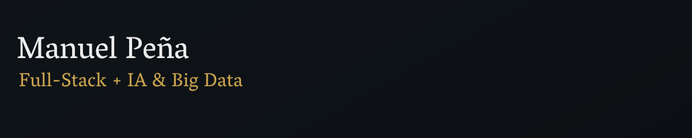
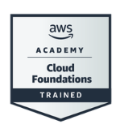
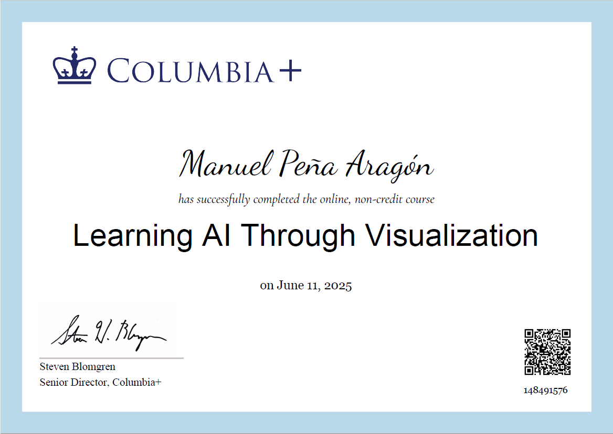
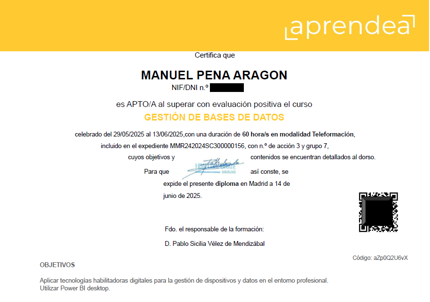
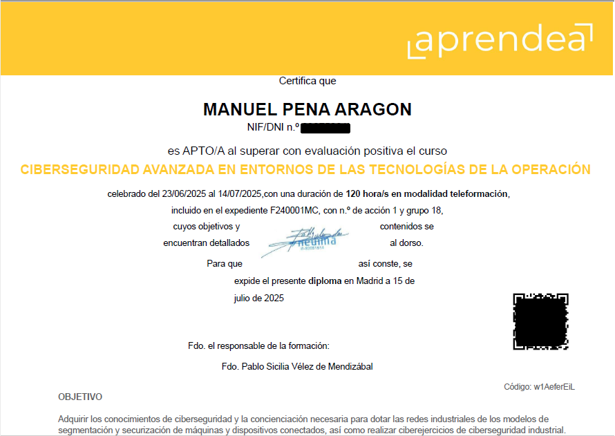

  Combinando la solidez del desarrollo <strong>Full Stack</strong> con los nuevos paradigmas de la 
  <strong>Inteligencia Artificial</strong> para diseñar soluciones inteligentes que no solo ejecutan tareas,
  sino que <strong>aprenden y deciden</strong>.

  Actualmente cursando el <strong>Máster de Especialización en IA y Big Data</strong>.

###  🛠️ Tech Stack

### 🧠 Inteligencia Artificial & Data

  
  
  
  
  
  
  
  

### ☁️ Cloud, Datos & DevOps

  
  
  
  
  
  

### 🌐 Desarrollo Full-Stack

  
  
  
  
  
  
  

---
### 🌍 Idiomas

  

### 🎓 Formación Académica Oficial

🤖 <b>Máster de Especialización en IA y Big Data (Cursando)</b>

 
  <i>Actualmente en curso. Finalización prevista: 2025.</i>

🏛️ <b>Técnico Superior en Desarrollo de Aplicaciones Web (DAW)</b>

 
  <i>Título Oficial de Formación Profesional Superior.</i>

---

### 🏆 Certificaciones y Cursos de Especialización

  ☁️ <b>AWS Certified Cloud Practitioner — Amazon Web Services</b>
  &nbsp; <a href="https://www.credly.com/badges/63a6a358-f439-4e48-a0e7-5df01e71f07f/public_url" target="_blank">🔗 [Verificar Oficial]</a>

 
  

  🇺🇸 <b>Learning AI Through Visualization — Columbia University (+)</b>
  &nbsp; <a href="https://badges.plus.columbia.edu/40394477-cea9-4eea-adbb-334e97947527#acc.qO1AkMb4" target="_blank">🔗 [Verificar Oficial]</a>

 
  

📊 <b>Power BI: Análisis y Visualización de Datos — SEPE</b>

 
  

🛡️ <b>Fundamentos de Ciberseguridad — SEPE</b>

 
  

